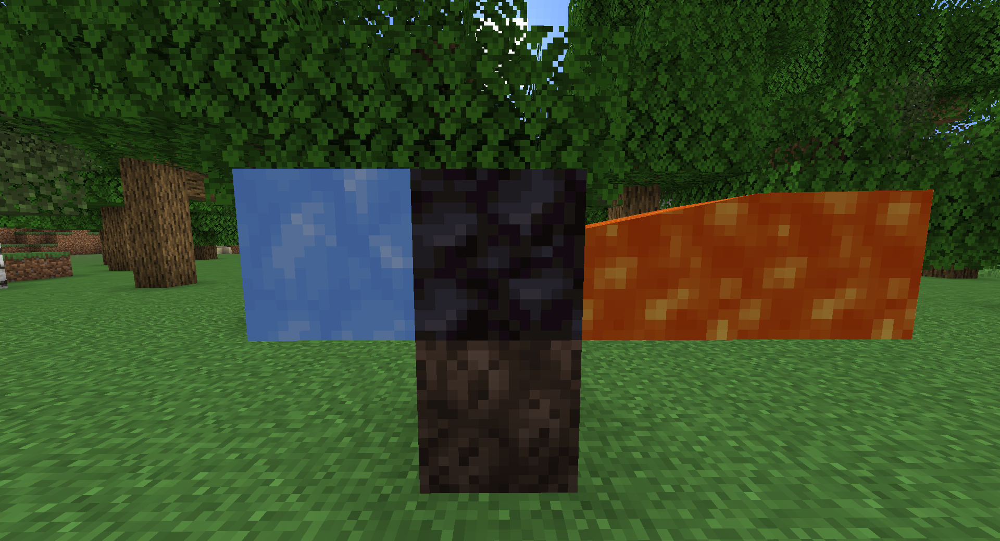
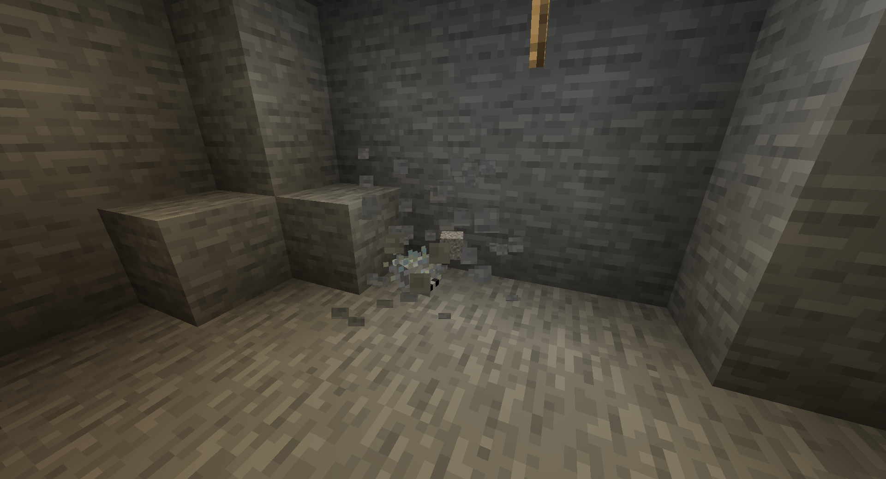

# Random Things

A collection of random things that add interesting aspects to the game.

## Configuration

Everything can be enabled/disabled in the configuration.

## Currently Implemented Features

### Vacuum Hoppers

A simple style of vacuum hopper that is found frequently in modded.  
A vacuum hopper can be made by placing a purple carpet on top of a hopper
and will collect items within a radius of 5 blocks.

### Renewable Blackstone

Blackstone generates similarly to basalt, except using soul *sand* rather than soul soil.

### Renewable Deepslate

When cobblestone or stone is generated when water and lava mix below y=0,
cobbled deepslate or deepslate are made respectively.

### Renewable Sponges

Makes lightning cause guardians withing 4 blocks convert to elder guardians in order to get renewable sponges.

### Silver Fish Drop Gravel

Silverfish drop gravel items when breaking out of infested blocks.

### Right Click Harvest Crops

When a player right-clicks on fully grown crops, the crop will be harvested and replanted automatically.

### Twerk Bonemeal

When a player spams sneak (twerk), blocks around it will have bone meal applied to them.

### Dispenser Break Blocks

When a dispenser uses a pickaxe, axe, shovel, or shears on a block, it will break using the tool.

### Dispenser Till Blocks

When a dispenser uses a hoe on dirt, grass block, or coarse dirt, it will act as though it has been right clicked with
the hoe.

(Dirt/Grass Block -> Farmland)  
(Coarse Dirt -> Dirt)

